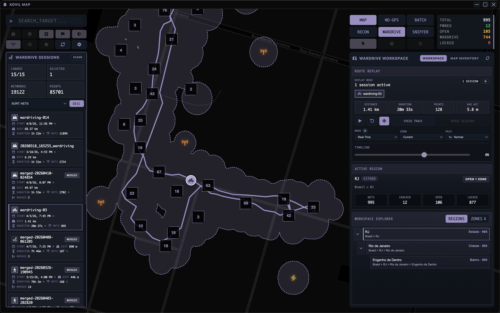

# KOVIL MAP

[](https://github.com/vitormartins1/kovil-map/actions/workflows/quality.yml)
[](https://github.com/vitormartins1/kovil-map/actions/workflows/security.yml)


English | [Portuguese (BR)](README__ptbr.md)

KOVIL MAP is a local-first desktop command center for Wi-Fi reconnaissance, WarDrive analysis, remote capture sync, RAW/PCAP enrichment, and cracking workflows.

It combines an Electron frontend with a FastAPI backend so operators can inspect networks on a tactical map, move into specialized workspaces, run long-lived jobs locally, and keep the operational state in one place.

The current operator-facing surfaces are the Tactical Map, Recon Center, WarDrive Workspace, and Raw Sniffer. Older internal names may still use `analytics`, but there is no separate Analytics screen in the current UI.

## Wardrive in Rio de Janeiro

<table>
  <tr>
    <td width="58%">
      
    </td>
    <td width="42%">
      
    </td>
  </tr>
  <tr>
    <td>Real WarDrive workspace view with replay controls, active-region context, and workspace explorer over Rio de Janeiro data.</td>
    <td>Illustrative concept art used to frame the Wardrive workflow in Rio de Janeiro.</td>
  </tr>
</table>

## What It Does

- **Tactical Map** for known networks, clusters, zones, favorites, targets, and popup actions.
- **Recon Center** for attack surface review, target intelligence, SIGINT, COMMS, GEO, OPS, and reporting flows.
- **WarDrive Workspace** for CSV session hierarchy, replay, active-region inspection, and map inventory.
- **Raw Sniffer** for RAW capture ingestion, metadata analysis, enrichment, and crack-ready artifact preparation.
- **Cracking Operations** with Hashcat, Aircrack-ng, HCX conversion, PMK/WPS helpers, batch execution, history, and process tracking.
- **Remote Sync** for Pwnagotchi over SSH/SFTP and Bruce/M5Evil over WebUI-based flows.

## Typical Flow

1. Import or sync handshakes, RAW captures, and wardrive sessions from local files or remote devices.
2. Review networks on the map, inspect popup intelligence, and choose a target or route.
3. Pivot into Recon Center, WarDrive, or Raw Sniffer depending on the task.
4. Run cracking or analysis jobs locally and monitor progress through the process panels.

## Getting Started

For operators:

- install a packaged release from [GitHub Releases](https://github.com/vitormartins1/kovil-map/releases)
- configure external tools such as `hashcat`, `hcxpcapngtool`, `aircrack-ng`, and `tshark` in the Settings screen
- use the [First Run Guide](docs/00-GETTING_STARTED/first-run.md) for sync/import and UI orientation

For developers:

```bash
git clone https://github.com/vitormartins1/kovil-map.git
cd kovil-map

cd backend
python -m venv .venv
source .venv/bin/activate
pip install -r requirements.txt -r requirements-dev.txt
python main.py
```

Open a second terminal:

```bash
cd frontend
npm install
npm start
```

Recommended docs:

- [Installation Guide](docs/00-GETTING_STARTED/installation.md)
- [First Run Guide](docs/00-GETTING_STARTED/first-run.md)
- [Current Product Surface](docs/00-GETTING_STARTED/current-product-surface.md)
- [Runtime Modes](docs/00-GETTING_STARTED/runtime-modes.md)
- [Features Guide](docs/02-FEATURES/README.md)
- [Workflows by Objective](docs/07-OPERATIONS/workflows-by-objective.md)
- [Testing Guide](docs/03-DEVELOPMENT/testing.md)

## Architecture

- `frontend/`: Electron desktop shell, renderer modules, styles, and unit tests
- `backend/`: FastAPI API, services, background jobs, schemas, and backend tests
- `docs/`: product, architecture, API, operations, security, and contribution docs

The backend is designed for local operation first and normally serves the desktop app at `127.0.0.1:8000`. Packaged builds can start the backend automatically.

## Project Status

- `main` is the stable branch
- `dev` is the public integration branch
- root governance and entry docs stay bilingual where applicable
- the repository ships with sanitized starter config, not live operator data

## Documentation

Start with the canonical docs hub: [docs/INDEX.md](docs/INDEX.md)

High-value entry points:

- [Getting Started](docs/00-GETTING_STARTED/README.md)
- [Current Product Surface](docs/00-GETTING_STARTED/current-product-surface.md)
- [Runtime Modes](docs/00-GETTING_STARTED/runtime-modes.md)
- [Architecture](docs/01-ARCHITECTURE/README.md)
- [Features Guide](docs/02-FEATURES/README.md)
- [Workflows by Objective](docs/07-OPERATIONS/workflows-by-objective.md)
- [API Overview](docs/01-ARCHITECTURE/api-overview.md)
- [Operations](docs/07-OPERATIONS/)
- [Security Policy](SECURITY.md)
- [Contributing Guide](CONTRIBUTING.md)

## Responsible Use

KOVIL MAP is intended for authorized security research, lab work, auditing, and learning. Many capabilities are dual-use. Use it only on networks, captures, devices, and systems you own or are explicitly authorized to assess.

## Community

- report bugs and feature requests with GitHub Issues
- use [SECURITY.md](SECURITY.md) for sensitive vulnerability disclosure
- follow [CODE_OF_CONDUCT.md](CODE_OF_CONDUCT.md) when participating
- review [LICENSE](LICENSE) for the MIT license terms
