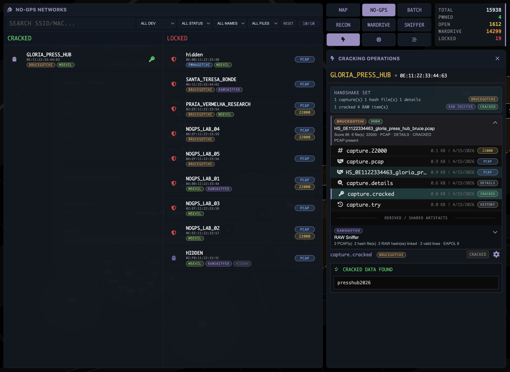
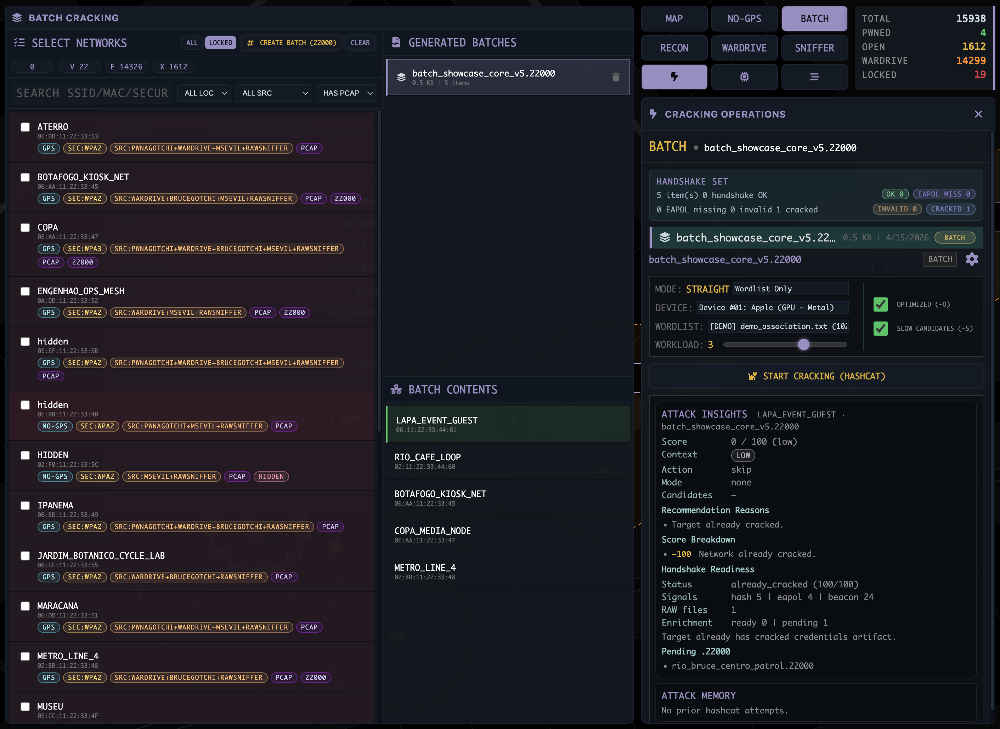
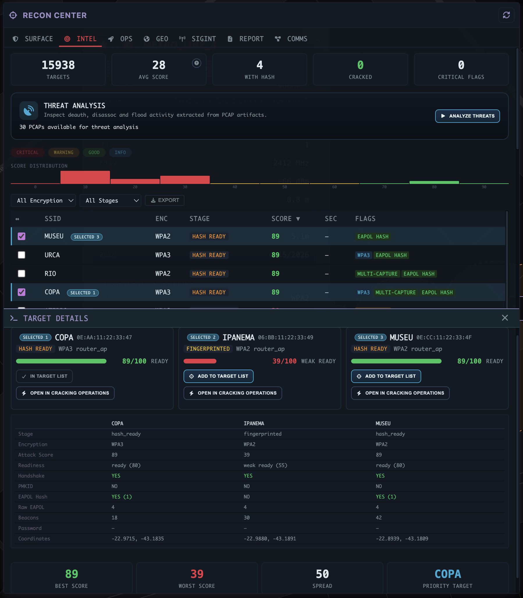
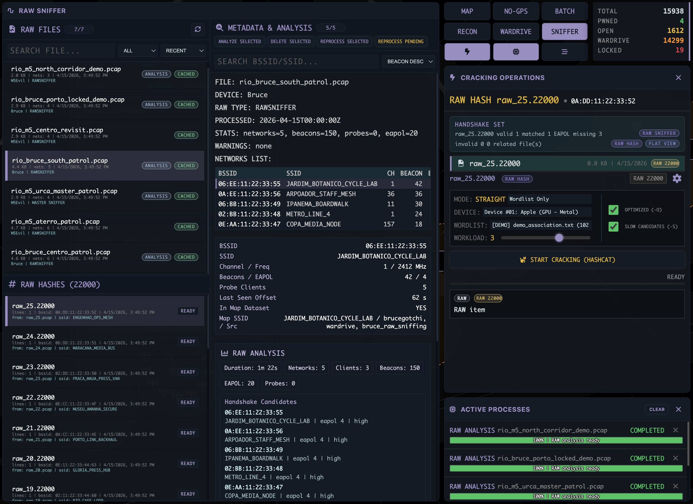

# KOVIL MAP

[](https://github.com/vitormartins1/kovil-map/actions/workflows/quality.yml)
[](https://github.com/vitormartins1/kovil-map/actions/workflows/security.yml)


English | [Portuguese (BR)](README__ptbr.md)

KOVIL MAP is a local-first desktop command center for Wi-Fi reconnaissance, WarDrive analysis, remote capture sync, RAW/PCAP enrichment, and cracking workflows.

It combines an Electron frontend with a FastAPI backend so operators can inspect networks on a tactical map, move into specialized workspaces, run long-lived jobs locally, and keep the operational state in one place.

The product is organized around the Tactical Map plus dedicated workspaces for Recon, WarDrive, and Raw Sniffer.

## Tactical Map

<p align="center">
  
</p>

- map-first cockpit for known networks, cluster review, popup actions, and rapid target triage
- spatial overlays for conquered, to-conquer, discovered, and intelligence-driven zone layers
- search and status-driven review across dense local datasets with source-aware context
- direct pivot points into cracking, Recon, and route review from the same operational surface

## No-GPS

<p align="center">
  
</p>

- dedicated workspace for networks that do not yet have usable coordinates on the tactical map
- filters for SSID or MAC search, source device, status, name visibility, and artifact presence
- split review between cracked and locked items so non-geolocated evidence can still be triaged fast
- one-click handoff into cracking operations from a selected no-gps network entry

## Batch

<p align="center">
  
</p>

- high-throughput workspace for building a single crack job from many networks and handshake artifacts
- operator filters for search, location, source, and artifact presence before creating the batch
- generated-batch inventory plus batch-contents review so work packages stay inspectable after creation
- optimized for wardrive and large pentest datasets where launching the cracking engine per target is too expensive

## Recon Center

<p align="center">
  
</p>

- unified intelligence workspace across SURFACE, INTEL, OPS, GEO, SIGINT, REPORT, and COMMS
- cache-first tab hydration so dense analysis views reopen faster without eager full-workspace loading
- COMMS cluster intelligence and map-facing Intelligence Zones for geospatial relationship review
- target-level drilldown for attack surface, threat analysis, signal intelligence, and operational planning

## Wardrive Workspace

<p align="center">
  
</p>

- session hierarchy and region drilldown for large CSV-derived route datasets
- route replay with pace, zoom, focus-track, and operator-controlled timeline playback
- active-region context with network totals and open/cracked/locked breakdowns
- workspace explorer for regions and zones, plus handoff to map inventory views
- local-first route review that lets operators move from wardrive sessions back into the tactical map and the wider target workflow

## Raw Sniffer

<p align="center">
  
</p>

- source-aware RAW capture workspace for Bruce and M5Evil ingest, metadata, and cleanup flows
- review of cache state, capture metadata, generated hashes, and capture-scoped RAW analysis reports
- network-aware bridge into cracking workflows through canonical hybrid hash preparation and raw-context artifacts
- intended for RAW evidence management without forcing every raw artifact into the main map

## Zones, Targets, and Favorites

- `ZONES` keeps map overlays actionable with dedicated views for conquered, to-conquer, discovered, and intelligence zones
- `TARGETS` acts as the mission list for networks you plan to attack, analyze, or batch together
- `FAVORITES` keeps a longer-lived shortlist of networks or places worth revisiting quickly
- these panels make it easier to move from wide map exploration into focused operational decisions

## Supporting Capabilities

- **Cracking Operations** with Hashcat, Aircrack-ng, HCX conversion, PMK/WPS helpers, batch execution, history, and process tracking
- **Remote Sync** for Pwnagotchi over SSH/SFTP and Bruce/M5Evil over WebUI-based flows

## Typical Flow

1. Import or sync handshakes, RAW captures, and wardrive sessions from local files or remote devices.
2. Review networks on the map, inspect popup intelligence, and choose a target or route.
3. Pivot into Recon Center, WarDrive, or Raw Sniffer depending on the task.
4. Run cracking or analysis jobs locally and monitor progress through the process panels.

## Getting Started

For operators:

- install a packaged release from [GitHub Releases](https://github.com/vitormartins1/kovil-map/releases)
- configure external tools such as `hashcat`, `hcxpcapngtool`, `aircrack-ng`, and `tshark` in the Settings screen
- use the [First Run Guide](docs/00-GETTING_STARTED/first-run.md) for sync/import and UI orientation

For developers:

```bash
git clone https://github.com/vitormartins1/kovil-map.git
cd kovil-map

cd backend
python -m venv .venv
source .venv/bin/activate
pip install -r requirements.txt -r requirements-dev.txt
python main.py
```

Open a second terminal:

```bash
cd frontend
npm install
npm start
```

Recommended docs:

- [Installation Guide](docs/00-GETTING_STARTED/installation.md)
- [First Run Guide](docs/00-GETTING_STARTED/first-run.md)
- [Current Product Surface](docs/00-GETTING_STARTED/current-product-surface.md)
- [Runtime Modes](docs/00-GETTING_STARTED/runtime-modes.md)
- [Features Guide](docs/02-FEATURES/README.md)
- [Workflows by Objective](docs/07-OPERATIONS/workflows-by-objective.md)
- [Testing Guide](docs/03-DEVELOPMENT/testing.md)

## Architecture

- `frontend/`: Electron desktop shell, renderer modules, styles, and unit tests
- `backend/`: FastAPI API, services, background jobs, schemas, and backend tests
- `docs/`: product, architecture, API, operations, security, and contribution docs

The backend is designed for local operation first and normally serves the desktop app at `127.0.0.1:8000`. Packaged builds can start the backend automatically.

## Project Status

- `main` is the stable branch
- `dev` is the public integration branch
- root governance and entry docs stay bilingual where applicable
- the repository ships with sanitized starter config, not live operator data

## Documentation

Start with the canonical docs hub: [docs/INDEX.md](docs/INDEX.md)

High-value entry points:

- [Getting Started](docs/00-GETTING_STARTED/README.md)
- [Current Product Surface](docs/00-GETTING_STARTED/current-product-surface.md)
- [Runtime Modes](docs/00-GETTING_STARTED/runtime-modes.md)
- [Architecture](docs/01-ARCHITECTURE/README.md)
- [Features Guide](docs/02-FEATURES/README.md)
- [Workflows by Objective](docs/07-OPERATIONS/workflows-by-objective.md)
- [API Overview](docs/01-ARCHITECTURE/api-overview.md)
- [Operations](docs/07-OPERATIONS/)
- [Security Policy](SECURITY.md)
- [Contributing Guide](CONTRIBUTING.md)

## Responsible Use

KOVIL MAP is intended for authorized security research, lab work, auditing, and learning. Many capabilities are dual-use. Use it only on networks, captures, devices, and systems you own or are explicitly authorized to assess.

### Legal Compliance, Ethics, and Civil Liability

This software is classified as a dual-use tool. Although developed for educational use and security auditing, improper use can lead to serious legal consequences.

The summary below is provided for awareness and responsible use. It is informational only and does not replace legal advice.

#### 1. Criminal Law Scope

Unauthorized use of this tool may fall under criminal offenses defined by Brazilian law and by international instruments to which Brazil is a signatory, including the Budapest Convention on Cybercrime.

**Unauthorized device or network intrusion**  
Law No. 12.737/2012 (`Lei Carolina Dieckmann`), Art. 154-A, criminalizes invading another person’s computing device, including routers and networks, whether connected or not, through the improper violation of a security mechanism.

Attention:
Attempting to break a Wi-Fi password or otherwise bypass security without authorization may itself be understood as an unlawful violation of a security mechanism.

**Service disruption**  
Deauthentication attacks used to capture handshakes may also be treated as unlawful service interference under Art. 266 of the Brazilian Penal Code when they affect the connectivity or service availability of third parties.

#### 2. Civil Liability and Privacy

In addition to possible criminal penalties, an unauthorized operator may also face civil liability, including the duty to repair material and moral damages.

**Brazilian General Data Protection Law (`LGPD`, Law No. 13.709/2018)**  
Technical data such as MAC addresses and handshake material may be treated as personal data when they identify or make an individual identifiable. Collecting or processing that data without a valid legal basis, such as consent or a demonstrable legitimate interest, may lead to sanctions.

**Brazilian Civil Rights Framework for the Internet (`Marco Civil da Internet`, Law No. 12.965/2014)**  
Brazilian law protects privacy and the confidentiality of communications and provides for compensation when those rights are violated.

#### 3. The Myth of the “Open Network”

From a legal perspective, the fact that a Wi-Fi network is open or uses weak protection does not amount to implicit authorization for intrusion, traffic interception, or attacks.

**Express authorization**  
To conduct penetration testing lawfully, you should have a written contract or formal authorization from the network owner.

**Reasonable expectation of privacy**  
Users of a network, including open networks, may still have a legally protected expectation of privacy over their data and communications.

### User Code of Conduct

By using KOVIL MAP, you agree to follow these principles:

- **Authorization:** never attack networks, devices, or infrastructure without explicit permission from the owner.
- **Privacy:** do not collect, store, or disclose personal data belonging to third parties that may be obtained accidentally.
- **Non-destruction:** do not perform actions that may degrade, interrupt, or destroy services, including persistent DoS-style behavior.
- **Responsibility:** you are solely responsible for your actions. Ignorance of the law is not a defense.

KOVIL MAP — The world is yours to audit, ethically.

## Community

- report bugs and feature requests with GitHub Issues
- use [SECURITY.md](SECURITY.md) for sensitive vulnerability disclosure
- follow [CODE_OF_CONDUCT.md](CODE_OF_CONDUCT.md) when participating
- review [LICENSE](LICENSE) for the MIT license terms
