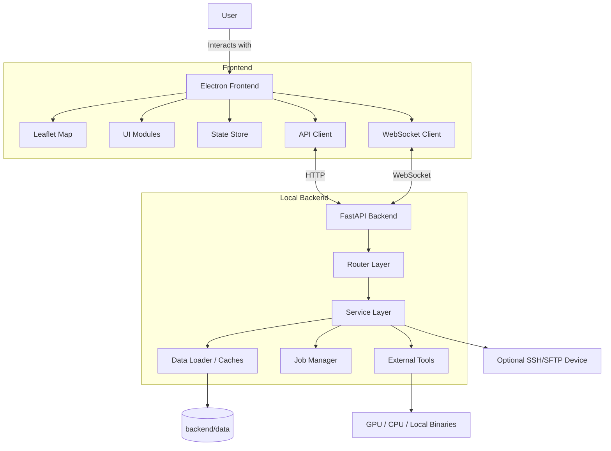

# System Design & Architecture

KOVIL MAP uses a local hybrid architecture: an Electron desktop shell for the user interface and a FastAPI backend for data loading, orchestration, and tool execution.

## High-Level Model

The application runs as a local client/server pair:

1. Electron renders the UI and manages desktop integration.
2. FastAPI exposes the local API and background job surface.
3. WebSocket events keep the UI synchronized with long-running work.
4. Local files remain the canonical data source.

## Frontend Architecture

The frontend is modular and framework-light. Its main responsibilities are:

- map rendering and spatial overlays
- workspace panels and replay controls
- job and sync feedback
- local desktop integration through the preload bridge

Key modules:

| Module | Responsibility |
| --- | --- |
| `main.js` | Electron main process, backend lifecycle, desktop window management |
| `preload.js` | safe bridge between renderer and desktop capabilities |
| `api.js` | authenticated API wrapper for the local backend |
| `socket.js` | WebSocket lifecycle and event distribution |
| `map.js` | Leaflet rendering, layers, playhead tracking, popup focus |
| `state.js` | shared frontend state |
| `ui.js` | global UI bootstrap and high-level event handling |
| `ui_wardrive.js` | WarDrive workspace, replay, sessions, regions, inventory |

## Backend Architecture

The backend acts as the operational core of the app.

Main responsibilities:

- load and normalize local capture data
- orchestrate cracking and conversion tools
- ingest and enrich RAW captures
- provide analytics and WarDrive hierarchy payloads
- manage background jobs and WebSocket updates

Key layers:

| Layer | Responsibility |
| --- | --- |
| Router layer | request validation, routing, error handling |
| Service layer | domain logic and tool orchestration |
| Job manager | async process execution and streaming status updates |
| Data loader | dataset assembly, caching, and normalization |
| Utility layer | path safety, response helpers, PCAP resolution, validators |

The backend is also moving toward thinner routers for workspace-heavy domains such as Recon:

- routers stay responsible for HTTP contracts and endpoint composition
- feature services hold runtime cache helpers, dataset read-model assembly, scoring logic, and tab-specific read models such as Recon COMMS
- cache invalidation hooks are callable from maintenance flows without importing router modules

`sync_service.py` is also being split by concern:

- `sync_service.py` keeps target orchestration and public sync/probe flows
- shared SSH host-key, known-hosts, URL/path normalization, and WebUI fetch/parsing helpers move into dedicated infrastructure helper modules
- the `Pwnagotchi SSH` probe/sync flow is now isolated behind a dedicated helper module while `SyncService` keeps the same wrapper methods for callers and tests
- the `Bruce WebUI` probe/sync flow is also isolated behind a dedicated helper module, again keeping the service wrappers stable
- the `M5Evil Admin WebUI` browse/probe/download/sync flow is also isolated behind a dedicated helper module, completing the main adapter split of `SyncService`
- this preserves existing service method seams for tests and callers while shrinking the monolithic sync implementation

`data_loader.py` is also being split by concern:

- shared dataset orchestration stays in `data_loader.py`
- Wardrive ingest and normalization helpers move into dedicated helper modules
- Wardrive manifest/session path, merge, and CSV-manifest helpers also move into dedicated helper modules
- RAW metadata source discovery and enrichment helpers also move into dedicated helper modules
- prefixed handshake entry loading and cross-source merge helpers also move into dedicated helper modules
- primary handshake/GPS ingest and `no-gps` fallback parsing also move into dedicated helper modules
- final cross-source merge and dataset post-processing also move into dedicated helper modules
- this keeps compatibility for existing callers while reducing the size of the main loader

## Handshake Model

Handshake handling is now organized around handshake sets instead of a strict source-first model.

- one handshake set is keyed by normalized BSSID/MAC
- each set can contain multiple captures from Pwnagotchi, Brucegotchi, and M5 Evil
- every capture gets a stable `capture_id`
- the preferred capture is chosen from quality scoring, not only source priority
- compatibility routes still expose flat file views when needed

This allows cracking and fingerprint flows to prefer the best local artifact while still exposing per-device detail to the UI.

## Security Boundaries

The main trust boundaries are:

- renderer to preload bridge
- preload bridge to local backend
- backend to local filesystem
- backend to external binaries
- backend to optional remote SSH/SFTP device

Current hardening highlights:

- `contextIsolation: true`
- `nodeIntegration: false`
- `sandbox: true`
- vendored frontend runtime assets instead of remote CDN JavaScript
- local token auth in packaged runtime
- sanitized config reads for the renderer
- validated file names and controlled subprocess invocation

## File System Layout

Important data roots:

- `backend/data/handshakes/` for classic handshake artifacts and shared sidecars
- `backend/data/BrucePCAP/handshakes/` for Brucegotchi handshake captures
- `backend/data/BrucePCAP/rawsniffer/` for Bruce RAW captures
- `backend/data/m5evil/handshakes/` for M5 Evil handshake captures
- `backend/data/m5evil/rawsniffer/` for M5 Evil RAW captures
- `backend/data/wardrive/` for CSV sessions, manifest, tags, and merged sessions
- `backend/data/maps/` for country-pack map datasets
- `backend/config.json` for persistent local settings

## WarDrive Runtime

The WarDrive workspace combines:

- manifest-driven CSV ingest
- session selection and comparison
- route replay with camera follow and timing modes
- region hierarchy from country packs
- inventory and map-readiness diagnostics

Replay uses the frontend for timing logic and the backend for session-track data only.

## Related Docs

- [`data-flow.md`](data-flow.md)
- [`api-overview.md`](api-overview.md)
- [`../03-DEVELOPMENT/configuration.md`](../03-DEVELOPMENT/configuration.md)
- [`../08-SECURITY/hardening.md`](../08-SECURITY/hardening.md)
